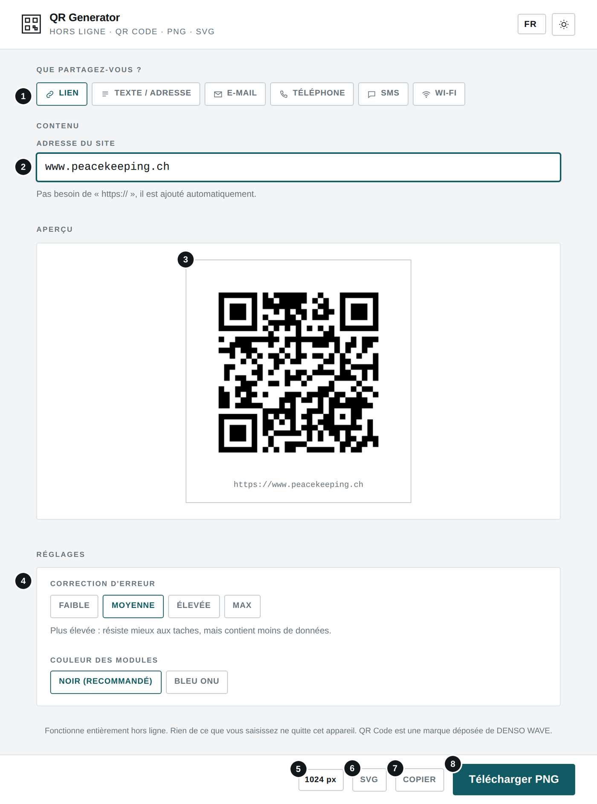
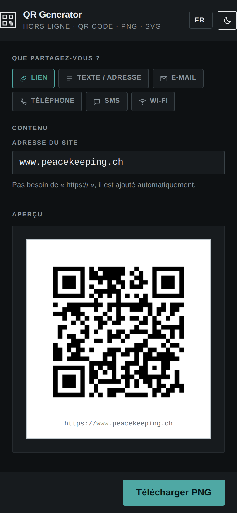
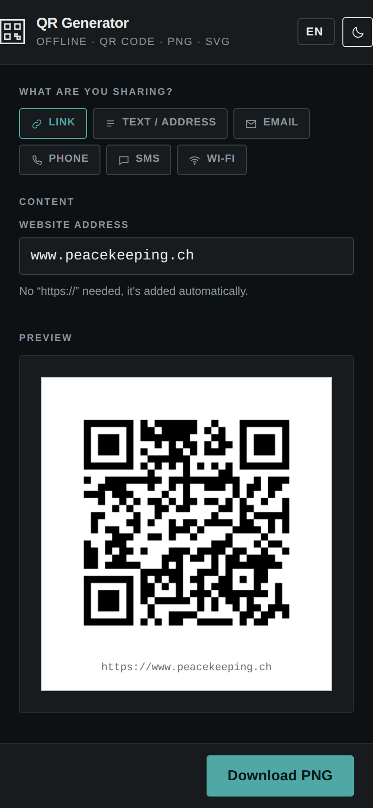
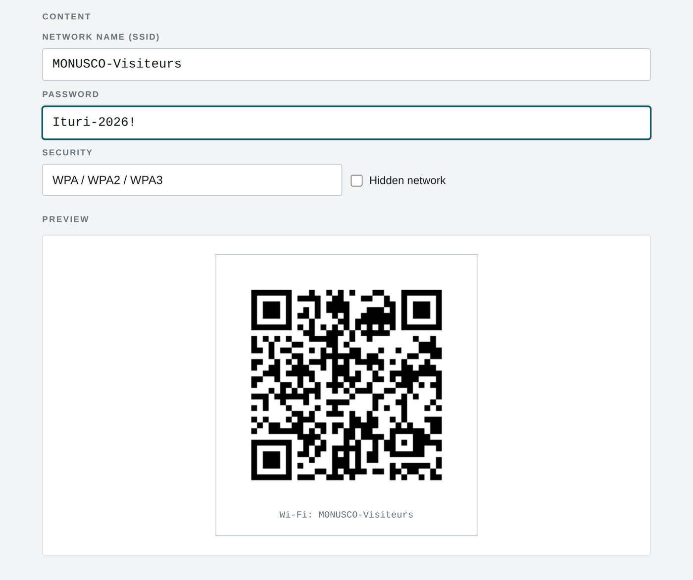

# QR Generator

**`QR_GENERATOR.html`** · Hors ligne · Aucune installation · Aucun envoi — *Offline · No install · No upload*

**[Français](#français) · [English](#english)**

---

## Français

### À quoi sert cet outil

Cet outil crée un QR code à partir d'un lien, d'un texte, d'une adresse e-mail, d'un numéro de téléphone, d'un SMS ou des identifiants d'un réseau Wi-Fi, puis l'exporte en image PNG ou SVG.

### Avant de commencer

- Ouvrez le fichier QR_GENERATOR.html par double-clic : il s'affiche dans votre navigateur (Chrome, Edge, Firefox ou Safari récents). Aucune installation n'est nécessaire.
- L'outil fonctionne sans connexion Internet. Aucun fichier n'est envoyé : tout le traitement se fait sur votre appareil.
- La langue (FR, EN, SW, LN) se choisit en haut à droite ; le bouton voisin bascule entre thème clair et sombre. Ces choix sont mémorisés.

### L'écran en un coup d'œil

1. Type de contenu
2. Champ de saisie (il change selon le type)
3. Aperçu en direct, avec le contenu encodé
4. Réglages : correction d'erreur et couleur
5. Taille du PNG (512, 1024 ou 2048 px)
6. Télécharger en SVG (vectoriel, pour l'impression)
7. Copier l'image dans le presse-papiers
8. Télécharger PNG

#### Sur téléphone (thème sombre)

### Utilisation pas à pas

1. Choisissez ce que vous partagez : Lien, Texte / adresse, E-mail, Téléphone, SMS ou Wi-Fi.
2. Remplissez les champs. L'aperçu se met à jour pendant la saisie ; le texte sous le QR code montre exactement ce qui sera lu.
3. Ajustez si besoin la correction d'erreur (« Moyenne » convient dans la plupart des cas ; « Élevée » ou « Max » pour un affichage extérieur exposé) et la couleur.
4. Téléchargez en PNG après avoir choisi la taille, en SVG, ou copiez l'image.
5. Testez toujours le QR code avec un téléphone avant de l'imprimer ou de le diffuser.

#### Effet du scan selon le type

| Type | Ce qui se passe au scan |
|---|---|
| **Lien** | Ouvre le site. « https:// » est ajouté automatiquement. |
| **Texte / adresse** | Affiche le texte. |
| **E-mail** | Ouvre un nouveau message prérempli (destinataire, objet, message). |
| **Téléphone** | Ouvre le composeur avec le numéro prêt à appeler. |
| **SMS** | Prépare un SMS avec le numéro et le message. |
| **Wi-Fi** | Connecte le téléphone au réseau (nom, mot de passe, sécurité). |

### Résultat

*Exemple Wi-Fi : nom du réseau, mot de passe et type de sécurité.*

### Bonnes pratiques

- Un QR code Wi-Fi contient le mot de passe en clair : ne l'affichez que là où ce réseau peut être partagé.
- Préférez le noir sur fond blanc et conservez la marge blanche autour du code. Imprimez-le à au moins 2 × 2 cm, plus grand pour une lecture à distance.
- Choisissez le SVG pour l'impression grand format et le PNG 2048 px pour les documents.
- Plus le contenu est long, plus le code est dense : raccourcissez-le si possible.

### En cas de problème

| Problème | Solution |
|---|---|
| **« Trop de données pour un seul QR code »** | Raccourcissez le contenu ou baissez la correction d'erreur. |
| **Le bouton « Copier » ne fonctionne pas** | Le navigateur ne le permet pas : utilisez le téléchargement. |
| **Le QR code ne se lit pas** | Vérifiez le contraste (noir recommandé), la taille d'impression et la marge blanche. |

### Confidentialité

L'outil fonctionne entièrement sur votre appareil, sans connexion Internet. Aucune donnée n'est transmise ni conservée en dehors des fichiers que vous téléchargez vous-même.

---

## English

### What this tool is for

This tool creates a QR code from a link, text, e-mail address, phone number, text message or Wi-Fi credentials, and exports it as a PNG or SVG image.

### Before you start

- Double-click QR_GENERATOR.html: it opens in your browser (recent Chrome, Edge, Firefox or Safari). Nothing to install.
- The tool works without an Internet connection. No file is uploaded: everything is processed on your device.
- Choose the language (FR, EN, SW, LN) at the top right; the button next to it switches between light and dark theme. Both choices are remembered.

### The screen at a glance

1. Content type
2. Input field (changes with the type)
3. Live preview, with the encoded content
4. Settings: error correction and colour
5. PNG size (512, 1024 or 2048 px)
6. Download as SVG (vector, for print)
7. Copy the image to the clipboard
8. Download PNG

#### On a phone (dark theme)

### Step by step

1. Choose what you are sharing: Link, Text / address, Email, Phone, SMS or Wi-Fi.
2. Fill in the fields. The preview updates as you type; the text under the QR code shows exactly what will be read.
3. If needed, adjust the error correction (“Medium” suits most cases; “High” or “Max” for exposed outdoor display) and the colour.
4. Download as PNG after choosing the size, as SVG, or copy the image.
5. Always test the QR code with a phone before printing or sharing it.

#### What scanning does, by type

| Type | What happens on scan |
|---|---|
| **Link** | Opens the website. “https://” is added automatically. |
| **Text / address** | Shows the text. |
| **Email** | Opens a pre-filled new message (recipient, subject, message). |
| **Phone** | Opens the dialler with the number ready to call. |
| **SMS** | Prepares a text message with the number and message. |
| **Wi-Fi** | Connects the phone to the network (name, password, security). |

### Result

*Wi-Fi example: network name, password and security type.*

### Good practice

- A Wi-Fi QR code contains the password in plain text: only display it where that network may be shared.
- Prefer black on white and keep the white margin around the code. Print it at least 2 × 2 cm, larger for scanning from a distance.
- Use SVG for large-format printing and PNG 2048 px for documents.
- The longer the content, the denser the code: shorten it when possible.

### Troubleshooting

| Problem | Solution |
|---|---|
| **“Too much to fit in one QR code”** | Shorten the content or lower the error correction. |
| **“Copy” does not work** | The browser does not allow it: use Download instead. |
| **The QR code does not scan** | Check contrast (black recommended), print size and the white margin. |

### Privacy

The tool runs entirely on your device, without an Internet connection. No data is sent or kept anywhere other than the files you download yourself.
